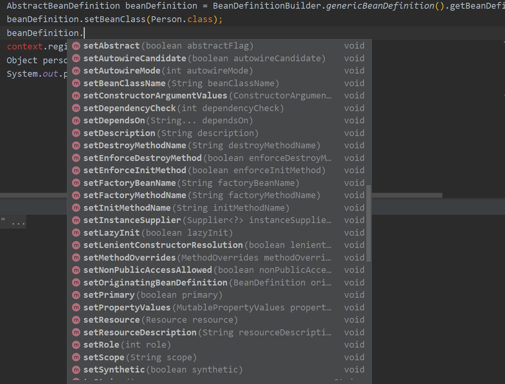

# 定义Spring Bean的方式

定义 Spring Bean的方式有六种，包括xml、@Bean、@Component、BeanDefinition、FactoryBean、Supplier


## JavaBean、SpringBean、对象之间的区别

### javaBean

JavaBean是一种JAVA语言写的可重用组件。JavaBean符合一定规范写的Java类，是一种规范。它的方法命名，构造以及行为必须符合特定的要求：

1. 所有属性为private
2. 这个类必须具有一个公共的（public）无参构造函数
3. private属性必须提供public的getter和setter来给外部访问，并且方法的命名也必须遵循一定的命名规范
4. 这个类是可序列化的，要实现serializable接口

### SpringBean

SpringBean是受Spring管理的对象  所有能受Spring容器管理的对象都可以成为SpringBean.

### 区别

**用处不同：**传统javabean更多地作为值传递参数，而spring中的bean用处几乎无处不在，任何组件都可以被称为bean。

**写法不同：**传统javabean作为值对象，要求每个属性都提供getter和setter方法；但spring中的bean只需为接受设值注入的属性提供setter方法。

**生命周期不同：**传统javabean作为值对象传递，不接受任何容器管理其生命周期，是通过new对象生成的；spring中的bean有spring管理其生命周期行为，由spring生成对象并管理。


## xml生成bean


1. 首先在resources下创建spring.xml文件
2. 创建一个java Bean类

```java
public class Person {
    private String name = "hemingyue";
    
    public Person() {
    }

    public String getName() {
        return name;
    }

    public void setName(String name) {
        this.name = name;
    }
}
```

3. 在spring.xml下声明bean标签

```xml
<?xml version="1.0" encoding="UTF-8"?>
<beans xmlns="http://www.springframework.org/schema/beans"
       xmlns:xsi="http://www.w3.org/2001/XMLSchema-instance"
       xmlns:p="http://www.springframework.org/schema/p"
       xsi:schemaLocation="http://www.springframework.org/schema/beans
        http://www.springframework.org/schema/beans/spring-beans.xsd">

    <bean id="person" class="com.hemingyue.Person"></bean>

</beans>
```

4. 测试Bean是否注册成功

```java
public class Test {
    public static void main(String[] args) {
        //指定配置文件的地址，
        ClassPathXmlApplicationContext context = new ClassPathXmlApplicationContext("spring.xml");
        Person person = context.getBean("person",Person.class);
        System.out.println(person.getName());
    }
}

```

## @Bean 注解方式定义Bean

第一种方式是从xml文件中定义bean，这种方式是在一个Config类中通过@Bean注解去定义一个Bean，@Bean只能标注在方法上。

1. 创建一个Config类，并写一个方法来返回一个类对象，在这个类对象上添加@Bean注解，此时容器中并没有Bean，还需要将这个Config类注册到容器中才可以，Bean的名字就是标了@Bean注解的方法名。

```java
public class Config {

    @Bean
    public Person person() {
        return new Person();
    }
    
}
```

2. 在AnnotationConfigApplicationContext容器中注册配置类并获取Bean

```java
public class Test {
    public static void main(String[] args) {
        //通过xml文件中的bean标签来定义Bean
        //ClassPathXmlApplicationContext context = new ClassPathXmlApplicationContext("spring.xml");
        //System.out.println(context.getBean("person"));

        //通过配置类和@Bean来定义Bean
        AnnotationConfigApplicationContext context = new AnnotationConfigApplicationContext(Config.class);
        Object person = context.getBean("person",Person.class);
        System.out.println(person);
    }
}
```

## @Component 定义Bean

@Component注解标注在类上面会定义Bean，但是@Component不能单独使用，我们需要定义Component的扫描路径才能扫描到@Component，因此我们要在配置类上定义扫描路径通过@ComponentScan

1. 在配置类上添加@ComponentScan注解并表明扫描范围

```java
@ComponentScan("com.hemingyue")
public class Config {


}
```

2. 在Bean类上添加@Component注解,此时Peron会作为Bean注册到容器中，名字默认为类的名字，首字母改为小写。

```java
@Component
public class Person {
    private String name = "hemingyue";

    public String getName() {
        return name;
    }

    public void setName(String name) {
        this.name = name;
    }
}
```

## BeanDefinition 定义Bean

**声明式：** @Bean、@Component、<bean>
**编程式：** BeanDefinition、FactoryBean

本节将讲解使用编程式的注解来定义一个Bean，
1. 首先我们要通过BeanDefinitionBuiler获得一个BeanDefinition，然后通过BeanDefinition来构造一个Bean，**声明式的定义Bean如@Bean等底层都是基于BeanDefinitin来实现的**，本节我们简单了解一下，之后会详细讲解。

```java
public class Test {
    public static void main(String[] args) {
        AnnotationConfigApplicationContext context = new AnnotationConfigApplicationContext(Config.class);

        //获取BeanDefinition
        AbstractBeanDefinition beanDefinition = BeanDefinitionBuilder.genericBeanDefinition().getBeanDefinition();
        //通过BeanDifiniton构造一个简单的Bean        
        beanDefinition.setBeanClass(Person.class);
        //将BeanDifinition注册进容器内
        context.registerBeanDefinition("person", beanDefinition);
        
        Object person = context.getBean("person");
        System.out.println(person);
    }
}
```



## 实现FactoryBean接口定义一个Bean

FactoryBean是一个接口，里面有三个方法，getObject来生成一个Bean，getObjectType来获得Bean的类型，isSingleton来指定Bean是单例还是原型。
```java

public interface FactoryBean<T> {
    String OBJECT_TYPE_ATTRIBUTE = "factoryBeanObjectType";

    @Nullable
    T getObject() throws Exception;

    @Nullable
    Class<?> getObjectType();

    default boolean isSingleton() {
        return true;
    }
}
```

我们需要实现这个接口，并将这个类注册到容器中
```java
@Component("person")
public class PersonFactoryBean implements FactoryBean {

    @Override
    public Object getObject() throws Exception {
        return new Person();
    }

    @Override
    public Class<?> getObjectType() {
        return Person.class;
    }

    @Override
    public boolean isSingleton() {
        return FactoryBean.super.isSingleton();
    }
}
```

此时，容器中会生成两个Bean，一个是getObject对象返回的Bean，名称是Component定义的名称。另外一个Bean是这个类生成的Bean，名称为&Person。

```java
        Person person = context.getBean("person", Person.class);
        System.out.println(person);
        PersonFactoryBean bean = context.getBean("&person", PersonFactoryBean.class);
        System.out.println(bean);

com.hemingyue.Person@4e718207
com.hemingyue.PersonFactoryBean@1d371b2d
```

## 通过Supplier lambda表达式注入一个Bean
```java
public class Test {
    public static void main(String[] args) {

        AnnotationConfigApplicationContext context = new AnnotationConfigApplicationContext(Config.class);

        context.registerBean(Person.class);
        Person person = context.getBean("person", Person.class);
        System.out.println(person);
    }
}

com.hemingyue.Person@5f3a4b84
```

我们可以使用registerBean注册一个Bean通过类名，但是此时只能由Spring自动生成Bean，可以使用Supplier动态生成一个自定义的Bean


```java
public class Test {
    public static void main(String[] args) {

        AnnotationConfigApplicationContext context = new AnnotationConfigApplicationContext(Config.class);
        
        context.registerBean(Person.class,()->{
            Person person = new Person();
            person.setName("何明月");
            return person;
        });

        Person person = context.getBean("person", Person.class);
        System.out.println(person);
    }
}

何明月
```
